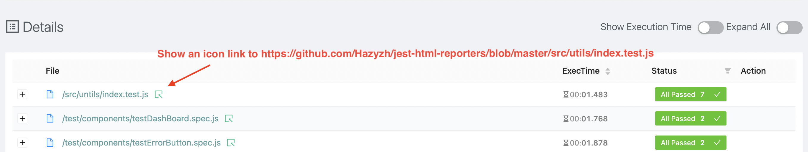

### Jest reporter

[](https://www.npmjs.com/package/jest-html-reporters)
[](http://npmjs.com/jest-html-reporters)
[](https://www.npmjs.com/package/jest-html-reporters)

Jest test results processor for generating a summary in HTML


### Installation

---

```shell
  npm install jest-html-reporters --save-dev
```

### Usage

---

Configure Jest to process the test results by adding the following entry to the Jest config (jest.config.json):

```json
"jest": {
  ...,
  "reporters": [
    "default",
    "jest-html-reporters"
  ],
  ...
}

```

As you run Jest from within the terminal, a file called `jest_html_reporters.html` will be created within your root folder containing information about your tests.

### Available Options

The options below are specific to the reporter.

| Option Name                | env variables name                              | Type    | Default                            | Description                                                                                                                                                                                                                                                                                          |
| :------------------------- | :---------------------------------------------- | :------ | :--------------------------------- | :--------------------------------------------------------------------------------------------------------------------------------------------------------------------------------------------------------------------------------------------------------------------------------------------------- |
| `publicPath`               | JEST_HTML_REPORTERS_PUBLIC_PATH                 | string  | ''                                 | specify the base path                                                                                                                                                                                                                                                                                |
| `filename`                 | JEST_HTML_REPORTERS_FILE_NAME                   | string  | jest_html_reporters.html           | Filename of saved report <br> _Applies to the generated html_                                                                                                                                                                                                                                        |
| `expand`                   | JEST_HTML_REPORTERS_EXPAND                      | Boolean | false                              | specify whether default expand all data                                                                                                                                                                                                                                                              |
| `pageTitle`                | JEST_HTML_REPORTERS_PAGE_TITLE                  | string  | Report                             | specify header and page title                                                                                                                                                                                                                                                                        |
| `logoImgPath`              | JEST_HTML_REPORTERS_LOGO_IMG_PATH               | string  | undefined                          | specify path of the image that will be displayed to the right of page title                                                                                                                                                                                                                          |
| `hideIcon`                 | JEST_HTML_REPORTERS_HIDE_ICON                   | boolean | false                              | hide default icon                                                                                                                                                                                                                                                                                    |
| `customInfos`              | JEST_HTML_REPORTERS_CUSTOM_INFOS                | array   | undefined                          | show some custom data info in the report, example value `[ {title: 'test1', value: 'test1'}, {title: 'test2', value: 'test2'}]`, you can also set value to a environment variable **JEST_HTML_REPORTERS_CUSTOM_INFOS**, see detail in [#32](https://github.com/Hazyzh/jest-html-reporters/issues/32) |
| `testCommand`              | JEST_HTML_REPORTERS_TEST_COMMAND                | string  | "npx jest"                         | copy command content to quickly run test file                                                                                                                                                                                                                                                        |
| `openReport`               | JEST_HTML_REPORTERS_OPEN_REPORT                 | json    | in dev=true, rest=false            | options for npm package `open`                                                                                                                                                                                                                                                                       |
|`env variable support only` | JEST_HTML_REPORTERS_TEMP_DIR_PATH               | string  | system default temporary directory | path to a temporary folder with attachments                                                                                                                                                                                                                                                          |
| `failureMessageOnly`       | JEST_HTML_REPORTERS_FAILURE_MESSAGE_ONLY        | number | 0                              | **0** : always create report.  <br>**1** : show failure test suites messages only in Report.  <br>**2** : only create report when some test suites failed.                                                                                                                                                                                                                                               |
| `enableMergeData`               | JEST_HTML_REPORTERS_ENABLE_MERGE_DATA                 | boolean    | false            | for default enable merge test data feature                                                                                                                                                                                                                                                    |
| `dataMergeLevel`               | JEST_HTML_REPORTERS_DATA_MERGE_LEVEL                 | number    | 1            |  default merge test data level                                                                                                                                      |
| `inlineSource`       | JEST_HTML_REPORTERS_INLINE_SOURCE                 | boolean    | false          |  Option to save report in a single combined HTML file [#184](https://github.com/Hazyzh/jest-html-reporters/issues/184)                                                                                                                        |
| `urlForTestFiles`       | JEST_HTML_REPORTERS_URL_FOR_TEST_FILES                 | string    | ''          |  url for test files. If user set this value, Details table shows an icon link to each rows. The link is constructed by joining urlForTestFiles and relativePath (like `/src/utils/index.test.js`) for each tests. See the detail in [#221](https://github.com/Hazyzh/jest-html-reporters/issues/221)                                                                                                                        |
---

#### example add config options

```json
...,
"reporters": [
  "default",
  ["jest-html-reporters", {
    "publicPath": "./html-report",
    "filename": "report.html",
    "openReport": true
  }]
]
```

---

### some features.

- Collapsable Test Groups

This feature regrading to [#37](https://github.com/Hazyzh/jest-html-reporters/issues/37), if a test file has many test cases, here will show a Merge Data checkbox on the expanded table. You can check it to merge data and set the merge level to control how to combine those data.

For Example


- Attach screenshot to report

This feature regrading to [#36](https://github.com/Hazyzh/jest-html-reporters/issues/36), this package will a new method named `addAttach`.

```
interface IAddAttachParams {
    attach: string | Buffer;
    description: string;
    context: any;
    bufferFormat: string;
}
```

There are three params of this method, `description` is easy to understand. The param **`attach`** referring to the image, you can pass a `buffer` or `string`, if it was a buffer the package will help you create a dir named `jest-html-reporters-attach` and save that `buffer` as a `jpg` image in it under the `publicPath`. if you have already saved the image, just pass the image's path as the `attach` param.
`context` is an optional parameter. Here can be specified **context** (default is this.global).

Here is an Example with [puppeteer](https://github.com/puppeteer/puppeteer).

```javascript
// Example attach with **buffer**
const { addAttach } = require("jest-html-reporters/helper");
const puppeteer = require("puppeteer");

describe("just examples", () => {
  test("test buffer", async () => {
    const browser = await puppeteer.launch();
    const page = await browser.newPage();
    await page.goto("https://www.google.com");
    const data = await page.screenshot();
    await browser.close();
    await addAttach({
      attach: data,
      description: 'img 1',
    });
    await addAttach({
      attach: await fs.readFileSync('./test.mp4'),
      description: 'img 1',
      bufferFormat: 'mp4',
    });
    expect(1).toBe(1);
  });
});
```

```javascript
// Example attach with **string**
const { addAttach } = require("jest-html-reporters/helper");
const puppeteer = require("puppeteer");
const path = require("path");

describe("just examples", () => {
  test("case string", async () => {
    const filePath = path.resolve(__dirname, "./test.jpg");
    await browser.close();
    await addAttach({
      attach: filePath,
      description: 'test google 2',
    });

    await addAttach({
      attach: 'www.example.com/test.mp4',
      description: 'test video 2',
    });
    expect(1).toBe(2);
  });
});
```

it will show like this


- Attach a message to the report

This feature is in regards to [#63](https://github.com/Hazyzh/jest-html-reporters/issues/63) & [#64](https://github.com/Hazyzh/jest-html-reporters/issues/64). It allows you to add a message or log something to the html report with `addMsg()`

```
/**
 * @param {object} options - options object
 * @param {string} options.message - message string
 * @param {any} [options.context] - custom context (optional)
 */
const addMsg = async ({ message, context }) => { ... }
```

Only one parameter is required. If you stringify an object like this `JSON.stringify(object, null, 2)`, the object will be prettified.
`context` is an optional parameter. Here can be specified **context** (default is this.global).

Here is an Example with [Nightmare](https://www.npmjs.com/package/nightmare).

```javascript
const { addAttach, addMsg } = require("jest-html-reporters/helper");
const Nightmare = require("nightmare");

describe("Yet another example", () => {
  test("Both addAttach & addMsg with failure", async () => {
    const nightmare = Nightmare({ show: true });
    await addMsg({ message: JSON.stringify({ won: 1, too: 2 }, null, 2) });
    await nightmare.goto("https://duckduckgo.com");
    const s1 = await nightmare.screenshot();
    await addAttach(s1, "test duckduckgo 1");
    await nightmare.end();
    await addMsg({ message: JSON.stringify(process, null, 2) });
    expect(2).toEqual(1);
  }, 20000);
  test("addMsg with success", async () => {
    await addMsg({ message: JSON.stringify({ free: 3, for: 4 }, null, 2) });
    expect(2).toEqual(2);
  });
});
```


Message still displays without screenshots and with a successful test


- Show a link for each test file

If user set some value to `urlForTestFiles`, Details table shows an icon link to each rows. The link is constructed by joining urlForTestFiles (ex: `https://github.com/Hazyzh/jest-html-reporters/blob/master`) and relativePath (ex: `/src/utils/index.test.js`) for each tests.


